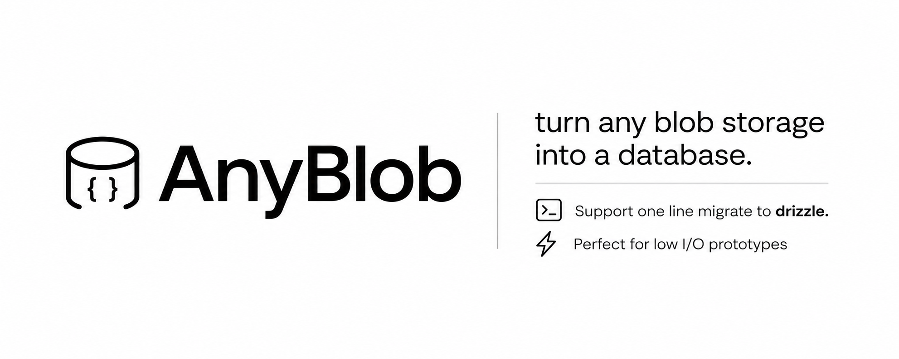

# AnyBlob



[](https://www.npmjs.com/package/anyblob)
[](https://www.npmjs.com/package/anyblob)
[](https://www.typescriptlang.org/)
[](./LICENSE)
[](https://vercel.com/docs/storage/vercel-blob)

A lightweight database on top of [Vercel Blob](https://vercel.com/docs/storage/vercel-blob) or [Cloudflare R2](https://developers.cloudflare.com/r2/), with a [drizzle](https://orm.drizzle.team/)-inspired query API. No SQL, no migrations, no extra infrastructure — just your blob store. Not sure if you do, I am tired of going to an UI, provision a new database. We already have file storage and quite frankly, A LOT of them. Why not just use them? When we are prototyping, or the I/O traffic is low... why should we pay and spin up database anyways? Swap to drizzle and production postgres/mysql whenever you are ready.

This package turn any storage into a database. Same interface as drizzle. One line migration.

> **Not a replacement for** Postgres, PlanetScale, or any real database — every query reads and writes a JSON file.

---

## install

```bash
npm install anyblob @vercel/blob   # vercel blob (default adapter)
npm install anyblob              # cloudflare r2 via workers binding — no extra deps
npm install anyblob aws4fetch      # cloudflare r2 / s3 over http from anywhere
```

Only the peer dependency for the adapter you use needs to be installed — the others are never loaded.

## setup

```ts
import { createDb } from "anyblob"

const db = createDb({
  token: process.env.BLOB_READ_WRITE_TOKEN!, // from your Vercel project
  prefix: "my-app",                           // optional — namespaces blob keys
  access: "private",                          // "public" | "private" (default: "public")
  maxRetries: 3,                              // retries on write conflicts (default: 3)
})
```

## adapters

The query API is identical on every backend — pick a storage adapter drizzle-style with the `adapter` field. Omitting it defaults to `"vercel-blob"`, so existing code keeps working unchanged.

### cloudflare r2 (workers binding)

Zero extra dependencies. Use inside Cloudflare Workers or Pages Functions with an [R2 bucket binding](https://developers.cloudflare.com/r2/api/workers/workers-api-reference/):

```ts
// wrangler.toml: [[r2_buckets]] binding = "MY_BUCKET", bucket_name = "my-db"
const db = createDb({
  adapter: "r2",
  bucket: env.MY_BUCKET,
  prefix: "my-app",
})
```

Full runnable worker with a CRUD endpoint: [`examples/worker`](examples/worker).

### cloudflare r2 / any s3-compatible store (http)

Works from any runtime (Node, edge, workers) using R2's [S3-compatible API](https://developers.cloudflare.com/r2/api/s3/api/). Needs the tiny (~2.5kB) [`aws4fetch`](https://github.com/mhart/aws4fetch) peer dependency for request signing:

```ts
const db = createDb({
  adapter: "s3",
  accountId: process.env.R2_ACCOUNT_ID!,      // endpoint derived: https://<id>.r2.cloudflarestorage.com
  bucket: "my-db",
  accessKeyId: process.env.R2_ACCESS_KEY_ID!,
  secretAccessKey: process.env.R2_SECRET_ACCESS_KEY!,
  prefix: "my-app",
})
```

For AWS S3, MinIO, or any other S3-compatible store, pass `endpoint` (and optionally `region`) instead of `accountId`. Runnable example against R2: [`examples/r2.ts`](examples/r2.ts).

### bring your own

Implement the two-method `StorageAdapter` interface for anything else:

```ts
import type { StorageAdapter } from "anyblob"

const myStorage: StorageAdapter = {
  async read(pathname) { /* return { text, etag } */ },
  async write(pathname, body, etag) { /* throw { status: 412 } on etag mismatch */ },
}

const db = createDb({ adapter: "custom", storage: myStorage })
```

---

## define your schema

```ts
import { defineTable, col } from "anyblob"

const users = defineTable("users", {
  id:     col.text("id").primaryKey().default(() => crypto.randomUUID()),
  name:   col.text("name"),
  email:  col.text("email"),
  age:    col.integer("age"),
  active: col.boolean("active").default(true),
})

const posts = defineTable("posts", {
  id:       col.text("id").primaryKey().default(() => crypto.randomUUID()),
  authorId: col.text("authorId").references(() => users.id), // FK → users.id
  title:    col.text("title"),
  published: col.boolean("published").default(false),
})
```

**column types:** `text` · `integer` · `number` · `boolean` · `timestamp` · `json`

**column modifiers:**
- `.primaryKey()` — marks the primary key (used for upsert conflict detection)
- `.default(val | () => val)` — static or computed default applied on insert
- `.references(() => otherTable.col)` — declares a FK; enables auto-join without an explicit `ON` clause

---

## crud

### insert

```ts
// single row — defaults applied automatically
const [user] = await db.insert(users)
  .values({ name: "Alice", email: "alice@example.com", age: 30 })
  .returning()

// batch insert
await db.insert(users).values([
  { name: "Bob",   email: "bob@example.com",   age: 25 },
  { name: "Carol", email: "carol@example.com", age: 35 },
])
```

### select

```ts
import { eq, and, gt } from "anyblob"

// all rows
const all = await db.select().from(users)

// filtered
const adults = await db.select().from(users).where(gt(users.age, 18))

// compound condition
const active_adults = await db.select().from(users)
  .where(and(gt(users.age, 18), eq(users.active, true)))
```

### update

```ts
const [updated] = await db.update(users)
  .set({ age: 31 })
  .where(eq(users.name, "Alice"))
  .returning()
```

### delete

```ts
await db.delete(users).where(eq(users.name, "Alice"))

// with returning
const [removed] = await db.delete(users)
  .where(eq(users.id, "some-id"))
  .returning()
```

---

## operators

| operator | usage |
|---|---|
| `eq(col, val)` | `col = val` |
| `ne(col, val)` | `col != val` |
| `gt(col, val)` | `col > val` |
| `gte(col, val)` | `col >= val` |
| `lt(col, val)` | `col < val` |
| `lte(col, val)` | `col <= val` |
| `like(col, pattern)` | substring match (case-insensitive) |
| `inArray(col, [vals])` | `col IN (...)` |
| `and(...conditions)` | logical AND |
| `or(...conditions)` | logical OR |

---

## joins

Foreign keys declared with `.references()` let you omit the `ON` clause — the join condition is inferred automatically.

```ts
// explicit ON (always works)
const rows = await db.select().from(posts)
  .innerJoin(users, eq(posts.authorId, users.id))

// auto ON — inferred from posts.authorId.references(() => users.id)
const rows = await db.select().from(posts).innerJoin(users)

// left join — keeps posts with no matching user (fields are undefined)
const rows = await db.select().from(posts).leftJoin(users)

// 3-table chain — FK chain is resolved automatically
const rows = await db.select().from(comments)
  .innerJoin(posts)  // comments.postId → posts.id
  .innerJoin(users)  // posts.authorId  → users.id
  .where(eq(users.name, "Alice"))
```

Joined rows are flat objects — all columns from all tables are merged together.

---

## upsert

```ts
await db.insert(users)
  .values({ id: "u-1", name: "Alice", email: "a@example.com", age: 30 })
  .onConflict(users.id, { set: { name: "Alice Updated", age: 31 } })
```

If a row with the same primary key already exists, the columns in `set` are updated instead of inserting a duplicate.

---

## transactions

Mutations inside a transaction are buffered and committed together. If an error is thrown, all touched tables are restored to their pre-transaction state.

```ts
const userId = await db.transaction(async (tx) => {
  const [user] = await tx.insert(users)
    .values({ name: "Alice", email: "a@example.com", age: 30 })
    .returning()

  await tx.insert(posts)
    .values({ authorId: user.id, title: "First post" })

  return user.id
})
```

> **Note:** this is not ACID — concurrent readers may observe partial state during execution. On failure, all mutations are rolled back.

---

## wipe

Clears all rows from one or more tables in parallel. Useful in tests.

```ts
await db.wipe(users, posts, comments)
```

---

## type inference

```ts
import type { InferRow, InsertRow } from "anyblob"

type User = InferRow<typeof users._schema>
// { id: string; name: string; email: string; age: number; active: boolean }

type NewUser = InsertRow<typeof users._schema>
// { name: string; email: string; age: number; id?: string; active?: boolean }
// — columns with defaults become optional
```

---

## how it works

Each table is stored as a single JSON blob at `<prefix>/<table-name>.json`. Reads fetch the file, parse it, filter/transform in memory, and writes upload the updated JSON back. Concurrent writes use ETag conditional writes to detect conflicts and retry automatically — `If-Match` on Vercel Blob and the S3 API, `onlyIf: { etagMatches }` on the R2 binding (R2 [supports these natively](https://developers.cloudflare.com/r2/api/workers/workers-api-reference/)).

This means every query is a round-trip to your blob store. Keep tables small (hundreds to low thousands of rows) and avoid high-frequency concurrent writes.

---

## license

MIT
